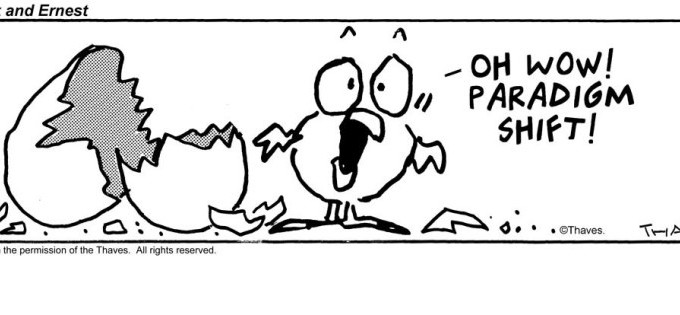
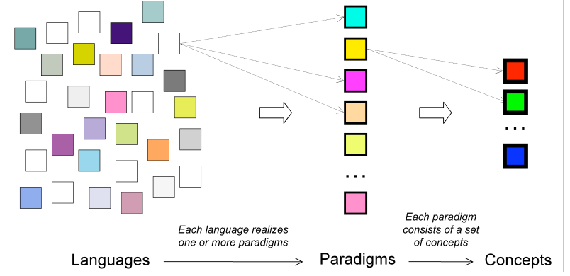

## Características das linguagens de programação

### Roteiro

1. Linguagens, paradigmas e conceitos
2. Por que estudar conceitos de linguagens de programação?
3. Principais Características
4. Método de implementação

***
### O que são linguagens de programação?

* Algumas definições:
  
> “A program is a sequence of symbols that specifies a computation. A programming language is a set of rules that specify which sequences of symbols constitute a program, and what computation the program describes." (Monti Ben-Ari - Understanding Programming Languages) 


>"A programming language is an artificial formalism in which algorithms can be expressed". (Gabbrielli, Maurizio, Martini, Simone - Programming Languages: Principles and Paradigms)

***
### Exemplos de linguagens de programação 

* Quais outras linguagens vocês já conhecem ? E o que já leram ou escutaram sobre elas ?

****

### Exemplos de linguagens de programação - PYPL

Segundo [PYPL PopularitY of Programming Language](http://pypl.github.io/PYPL.html) -Acessado em fevereiro de 2019

| Rank | Language     | Share   | Trend  |
|------|--------------|---------|--------|
| 1    | Python       | 26.42 % | +5.2 % |
| 2    | Java         | 21.2 %  | -1.3 % |
| 3    | Javascript   | 8.21 %  | -0.3 % |
| 4    | C#           | 7.57 %  | -0.5 % |
| 5    | PHP          | 7.34 %  | -1.2 % |
| 6    | C/C++        | 6.23 %  | -0.3 % |
| 7    | R            | 4.13 %  | -0.1 % |
| 8    | Objective-C  | 3.04 %  | -0.8 % |
| 9    | Swift        | 2.56 %  | -0.6 % |
| 10   | Matlab       | 1.98 %  | -0.4 % |
| 11   | TypeScript   | 1.61 %  | +0.2 % |
| 12   | Ruby         | 1.54 %  | -0.2 % |
| 13   | VBA          | 1.44 %  | -0.0 % |
| 14   | Scala        | 1.17 %  | -0.1 % |
| 15   | Kotlin       | 1.15 %  | +0.3 % |
| 16   | Visual Basic | 1.15 %  | -0.1 % |
| 17   | Go           | 1.05 %  | +0.3 % |
| 18   | Perl         | 0.58 %  | -0.2 % |
| 19   | Rust         | 0.43 %  | +0.1 % |
| 20   | Lua          | 0.35 %  | +0.0 % |
| 21   | Julia        | 0.3 %   | +0.1 % |
| 22   | Haskell      | 0.3 %   | +0.0 % |
| 23   | Delphi       | 0.25 %  | -0.1 % |


***

### Exemplos de linguagens de programação - Tiobe index

Segundo o [Tiobe index](https://www.tiobe.com/tiobe-index/), acessado em fevereiro de 2019


| Rank | Programming Language | Ratings | Change |
|------|----------------------|---------|--------|
| 1    | Java                 | 15.876% | +0.89% |
| 2    | C                    | 12.424% | +0.57% |
| 3    | Python               | 7.574%  | +2.41% |
| 4    | C++                  | 7.444%  | +1.72% |
| 5    | Visual Basic .NET    | 7.095%  | +3.02% |
| 6    | JavaScript           | 2.848%  | -0.32% |
| 7    | C#                   | 2.846%  | -1.61% |
| 8    | PHP                  | 2.271%  | -1.15% |
| 9    | SQL                  | 1.900%  | -0.46% |
| 10   | Objective-C          | 1.447%  | +0.32% |
| 11   | Assembly language    | 1.377%  | -0.46% |
| 12   | MATLAB               | 1.196%  | -0.03% |
| 13   | Perl                 | 1.102%  | -0.66% |
| 14   | Delphi/Object Pascal | 1.066%  | -1.52% |
| 15   | R                    | 1.043%  | -1.04% |
| 16   | Ruby                 | 1.037%  | -1.50% |
| 17   | Visual Basic         | 0.991%  | -1.19% |
| 18   | Go                   | 0.960%  | -0.46% |
| 19   | Groovy               | 0.936%  | +0.75% |
| 20   | Swift                | 0.918%  | -0.88% |

***


### Linguagens, paradigmas e conceitos

* Existem hoje diversas linguagens, e em um mesmo projeto ou empresa, podemos se deparar com diversas linguagens. 
* No mínimo, podemos citar as seguintes linguagens que provavelmente vocês irão usar ou participar de projetos que as use.


| Linguagens | Por que é relevante ? |
| ---------- | ---------------------- |
| Java       |  É ainda uma linguagem muita utilizada por grandes empresas e sistemas mais consolidades. Muito presente na web, e no mobile através do Android.              |
| Python     | Não é a linguagem mais nova, porem se popularizou mais nos últimos 10 anos. Destacando bastante para manipulação de dados e desenvolvimento de MVPs e em Startups.  |
| C          | E a linguagem mãe de muitas, e quando precisa integrar, vai ter que recorrer a ela. É ainda uma linguagem muito utilizada por sistemas operacionais, compiladores, banco de dados e sistemas embarcados. Quem usa linux, sabe que o kernel e os utilitários foram desevolvidos em C ou C++.                         |
| C++        |E ainda muito usado em muitos projetos, como em computação gráfica e "engines" de jogos. Muito do que se pode falar sobre C, vale para C++. Porém, é uma linguagem de mais alto nível e segura.                     |
| C#         | Junto com Java, é uma das preferidas para aplicações corporativas. Atualmente tem tido ainda mais procura, dado a aproximação da microsoft com o "open source".                       |
| JavaScript | Linguagem unipresente, reina absoluto no front end, e agora também no back end. Com o node js, as possibilidades de uso do JavaScript está cada vez maior, ele se libertou do navegador.                        |
| Ruby       | Com o seu framework On Rails, é ainda uma das melhores opções para desenvolvimento rápido e com qualidade para a web.                        |
| Dart       | Linguagem da Google, e pode ser usada para desenvolvimento hibrido de aplicações mobile. O Flutter é uma possibilidade forte para desenvolvimento multiplataforma.                        |
| Kotlin     | Linguagem recente, e por ser uma alternativa ao Java para Android. Tem muitas das caracteristicas legais do Scala, integra bem orientação objeto e funcional.                        |
| Swift      | Desenvolvimento nativo para IOs passa por essa linguagem.                       |
| Go         | Busca ser um C mais moderno, e talvez deparae com ele no desenvolvimento de microserviços                        |
| Scala      | Se for trabalhar com Big data,deve esbarrar em Spark. É uma linguagem multiparadigma, porém tem apelo mais forte para a programação funcional.                       |
| Clojure    | Linguagem funcional usada pela Nubank, tem muito potencial para web e análise de dados. É um dialeto Lisp, com muitos recursos interessante de metaprogramação.                     |
| R    | A linguagem muito utilizada por estatísticos e cientista de dados.                     |
| Elixir    | Linguagem funcional, brasileira, que roda da máquina virtual Erlang, com muito potencial para desenvolvimento Web                     |
| Lua    | Linguagem brasileira, que cresceu muito como linguagem de script para engine de jogos.                     |


*** 

### O que são paradigmas de programação?

* Entre tantas linguagens, podemos identificar diferenças e similaridades, como diria Humberto Gessinger:


> São todos iguais
> E tão desiguais
> uns mais iguais que os outros


* As linguagens dentro de um mesmo paradigma, tendem a ter mais similaridades.



***

### O que são paradigmas de programação?

* Definição:
  
  > “A paradigm is a distinctive style of programming. Each paradigm is characterized by the predominance of certain key concepts”. (David Watt -  Programming Language Design Concepts)




Fonte: [Peter Van Roy](https://www.info.ucl.ac.be/~pvr/VanRoyChapter.pdf)

***

### Paradigmas de programação

Um programa em assembly é uma sequência de operações do processador.

Um programa em uma linguagem de alto nível depende do paradigma de programação. Por exemplo

- pode ser uma coleção de subrotinas ou procedimentos
- pode ser uma coleção de objetos que se relacionam e se comunicam através de mensagens.
- pode ser uma composição e aplicações de funções
- pode  ser uma coleção de fatos e regras


* Imperativo
  * Estruturado (ou procedural): C, Ada, Pascal
  * Orientado a objeto: Smalltalk, C++, Java, Python, Ruby, Kotlin, C#
* Declarativo
  * Funcional: Haskell, Lisp, Clojure, Elixir ..
  * Lógico: Prolog, Mercury


> Vocês verão que as linguagens C e Java são bem similares, principalmente depois de conhecerem linguagens com Haskell e Prolog.


> Além dos quatro principais paradigmas, iremos tratar a progração concorrente e programação de scripting, como dois diferentes paradigmas. Seguindo assim a abordagem adotada por David Watt.


***

### Linguagens e conceitos

**Nem só de paradigmas vivem as linguagens**

Compare as seguintes descrições de linguagens de programação encontradas no primeiro parágrago da Wikipedia:

* Linguagem C
> C (/siː/, as in the letter c) is a general-purpose, **imperative** computer programming language, supporting **structured programming**, **lexical variable scope** and recursion, while a **static type system** prevents many unintended operations. By design, C provides constructs that map efficiently to typical machine instructions, and therefore it has found lasting use in applications that had formerly been coded in assembly language, including operating systems, as well as various application software for computers ranging from supercomputers to embedded systems. 

* Linguagem JavaScript

> JavaScript (/ˈdʒɑːvəˌskrɪpt/),[8] often abbreviated as JS, is a high-level, **interpreted** programming language that conforms to the ECMAScript specification. It is a language that is also characterized as **dynamic**, **weakly typed**, **prototype-based** and multi-paradigm. 

* Linguagem Python
  
> Python is an **interpreted**, high-level, general-purpose programming language. Created by Guido van Rossum and first released in 1991, Python has a design philosophy that emphasizes code readability, notably using significant whitespace. It provides constructs that enable clear programming on both small and large scales.[26] Van Rossum led the language community until stepping down as leader in July 2018.[27][28] Python features a **dynamic type system** and **automatic memory management**. It supports multiple programming paradigms, including **object-oriented**, **imperative**, **functional** and **procedural**, and has a large and comprehensive standard library.[29] 

* Lingagem Java
  
> Java is a general-purpose computer-programming language that is **concurrent**, **class-based**, object-oriented,[15] and specifically designed to have as few implementation dependencies as possible. It is intended to let application developers "write once, run anywhere" (WORA),[16] meaning that compiled Java code can run on all platforms that support Java without the need for recompilation.[17]

* Lingagem Dart
  
> Dart is a general-purpose programming language originally developed by Google and later approved as a standard by Ecma (ECMA-408).[7] It is used to build web, server, desktop, and mobile applications.[8]. Dart is an object-oriented, **class defined**, garbage-collected language[9] using a C-style syntax that transcompiles optionally into JavaScript. It supports **interfaces**, **mixins**, **abstract classes**, reified generics, **static typing**, and a sound type system.[10] 

* Linguagem Haskell

> Haskell /ˈhæskəl/[27] is a **statically typed**, **purely functional programming** language with **type inference** and **lazy evaluation**.[28][29] Type classes, which enable **type-safe** operator overloading, originated in Haskell.[30] Its main implementation is the Glasgow Haskell Compiler. It is named after logician Haskell Curry.[1] 

***

### Linguagens e conceitos

Algumas perguntas relacionadas aos conceitos das linguagens de programação

- Sistema de tipos ? estaticas ou dinâmicas ?
- Tem inferência de tipos ?
- Paradigmas de programação ?
- Class-baed ou prototype-based ?
- Casamento de padrões ?
- Funções como valores de primeira classe
- ...

***

### Por que estudar conceitos de linguagens de programação?

Segundo (Sebesta - Conceitos de linguagens de Programação), podemos destacar os seguintes argumentos:

* Capacidade aumentada para expressar ideias; 
* Embasamento para escolher linguagens adequadas;
* Habilidade aumentada para aprender novas linguagens; 
* Melhor uso de linguagens já conhecidas; 
* Avanço geral da computação.


> Por exemplo, nessa disciplina estaremos citando conceitos como: Inferência de tipos, polimorfismo paramétrico, funções como valores de primeira classe, funções de alta ordem, funções anônimas, tipos estáticos vs tipos dinâmicos, tipos fracos ou fortes, prototype based vs class based, mônadas (ex. Tipos opcionais no Swift e tipos nullable em kotlin).

> Entao, quando eu leio que uma dada linguagem é uma estaticamente tipada, fortemente tipada, com inferência de tipos, com funções de alta ordem, com tipos nullable, com suporte a funções anônimas ... Eu já sei muito sobre como usar a linguagem

***


### Principais Características


Discussões sobre linguagens de programação costuma ser muito "acaloradas" na web. Em geral, muitas avaliações são afetadas pela subjetividade. Porém, podemos usar as seguinte caracterìsticas quando comparar uma linguagem:

* Legibilidade
* Redigilidade
* Confiabilidade
* Custos
* Método de implementação


> essas são as características citadas em (Sebesta - Conceitos de Linguagens de Programação)
> 
***


### Característica: Legibilidade


Essa propriedade diz respeito à facilidade para se ler e entender um programa (Flavio Varejão).

* **Simplicidade**:
    > A language with a large number of basic constructs is more difficult to learn than one with a smaller number.

* **Feature multiplicity**: having more than one way to accomplish a particular operation. 
  * Por exemplo, diferentes modos de incrementar:
  
  ```C
  count = count + 1
  count += 1
  count++
  ++count
  ```

* **Sobrecarga**: O uso de um mesmo vocábulo da LP para denotar diferentes comportamentos dependendo do contexto. Por exemplo, sobrecarga de operadores. Qual o significado de `* ` no código abaixo:
  
  ```
  a = *p***q;
  ```
    * > Não existe sobrecarga em Java, e esse recurso foi considerado um dos culpados pelos códigos complexos escritos em Scala. O uso exagerado de sobrecarga de operadores.
    * A linguagem Go também não suporta, e deram a seguinte resposta:
        > "Experience with other languages told us that having a variety of methods with the same name but different signatures was occasionally useful but that it could also be confusing and fragile in practice. " https://golang.org/doc/faq#overloading
 
 
* **Ortogonalidade**; De acordo com Flavio Varejão, a Ortogonalidade diz respeito à capacidade da LP permitir ao programador combinar seus conceitos básicos sem que se produzam efeitos anômalos nessa combinação. Assim, uma LP é tão mais ortogonal quanto menor for o número de exceções aos seus padrões regulares.
  * Exemplos: A linguagem C possui um tipo chamando void. Porém, é possível apenas ter "funções" do tipo void e ponteiros para esse tipo.
  * Em C, o tipo struct pode ser retornado por uma função, porém não é possivel retornar um array.
  * Considere o seguinte código em java. Por que a quarta linha 4, não compila ?

    ```java
    int x, y = 2, z = 3;
    byte a, b = 2, c = 3;
    x = y + z;
    a = b + c;
    ```

***

### Característica: Redigilidade

Segundo Sebesta: 
    
>Writability is a measure of how easily a language can be used to create programs for a chosen problem domain. 

Importante o destaque do domínio. Por exemplo, a linguagem R tem como objetivo facilitar a escrita de códigos que manipulam e analisam dados, e não escrever um sistema oparacional.

* Muitos fatores que afetam a redigibilidade tambem afetam a legibilidade.

* A abstração é um requisito importante para a redigibilidade. O que diferencia as linguagens de alto nível das linguagens de baixo nível é a capacidade de criar abstrações. As abstrações, como funções, classes ... melhoram muito a legibilidade.
* Expressividade, de acordo com Sebesta "means that there are very powerful operators that allow a great deal of computation to be accomplished with a very small program". Por exemplo, cont++ é mais conveniente e curta do que count = count + 1. Em C, While é capaz de expressar qualquer problema, mas o for torna o codigo mais facil de escrever e ler:
  
  ```C
  int i = 0;
  while (i < 10) {
      /// comandos
      i++;
  }
  // o mesmo código com For
  for (int i =0 ; i < 10; i++) {
      ///comandos
  }
  ```
  * Em alguns caso, a redigibilidade e legibilidade pode entrar em conflito. O que faz o código abaixo:

```C
    void f(char *q, char *p) {
        for (;*q=*p; q++,p++);
    }

```

***


### Característica: Confiabilidade

Segundo Sebesta:
> A program is said to be reliable if it performs to its specifications under all conditions.

Alguns elementos presentes nas linguagens podem aumentar ou reduzir sua confiabilidade:

* **Checagem de erros de tipos**: linguagens estaticamente tipadas verificam erros de tipos em tempo de compilação, evitando assim erros em tempo de execução. Por exemplo, Java tende ser mais seguro que Python.
* **Linguagens mais fortemente tipadas**, evitam conversões implicitas, evitando erros em tempo de execução. C++ é mais fortemente tipada do que C, por exemplo, o seguinte código que compila em C, não compilaria em C++:
    
 ```C
    void f (int *p) {

    }
    int a;
    f (a);
  ```
* **Tratamento de exceções**: permte tanto interceptar erros, evitando sua propação, além de "obrigar" o programado a verificar os erros. Em Java por exemplo, ações como acessar um banco de dados precisam ser verificadas. Algo que linguagens que usam apenas códigos de erros, não coseguem "obrigar" os programadores verificá-los.
* **Manipular ponteiros** diretamente pode levar a comportamentos inesperados. Linguagens modernas tem evitado o acesso direto a memória pelo programador. Em C++, o programador tinha todo acesso a memória como em C, já a linguagem Java e outras mais recentes não tem esse recurso.
* **Null pointers**, porém, mesmo sem acesso direto a memória, erros relacionados ainda ocorrem em linguagens como Java e Python. Linguagens mais modernas como Scala, Swift e Kotlin, criaram mecanismos para evitar esse tipo de erro. No Java já existem um mecanismo a partir da versão 8.0, porém não é nativo.


> A partir dessas características podemos dizer que C++ é mais confiável do que C, e que Java é mais confiável do que C++ e Kotlin é mais confiável do que  Java.

***
### Característica: Custos

Por fim, para escolher uma linguagem existem diversos custos que precisam ser levado em conta (Sebesta):

* cost of training programmers
* cost of writing programs
* cost of compiling programs
* cost of executing programs
* cost of the language implementation system
* cost of poor reliability
* cost of maintaining programs

Of all the contributors to language costs, three are most important: program development, maintenance, and reliability. 


***

### Método de implementação


- Compilação: Linguagens que buscam ser mais eficientes e tem foco no desenvolvimento de sistemas com C, C++, Pascal, Fortran, Ada, Rust e Go. Aqui a compilação ocorre para o código de máquina. A linguagem Go é um exemplo de linguagem moderna que é capaz de compilar para diferentes sistemas operacionais e arquiteturas.
- Interpretada: linguagens usualmente de scripts e que rodam associadas a alguma aplicação, como navegadores web, servidores web, shell ...
- Híbrido: linguagens que são "compilada" para um código intermediário e depois executada em outro momento por máquinas virtuais. As três máquinas virtuais mais conhecidas são as máquinas do Java (JVM), Dotnet (CLR) e Erlang (BEAM).
  
  > Hoje diversas linguagens "compilam" para o bitecode da máquina virtual Java, como o Groovy, Kotlin, Clojure e Scala. 
  
  > Para a máquina virtual Erlang, temos a linguagem brasileira Elixir.


Linguagens intermediárias são usadas até mesmo por interpretadores. Por exemplo, em python:

```python
    import dis
    
def dobro (x):
    return 2*x
    
dis.dis(dobro)
```

Irá imprimir o código intermediária da função dobro:


    4           0 LOAD_CONST               1 (2)
                3 LOAD_FAST                0 (x)
                6 BINARY_MULTIPLY
                7 RETURN_VALUE


****

### Atividades

Leia o capítulo 1 do livro disponível gratuitamente [Flavio Varejão - Linguagens de Programação e Conceitos](https://www.inf.ufes.br/~fvarejao/livroLP.html).

Tentem responder, ou pelo menos reflita sobre essas questões. No final da disciplina podemos voltar nessas questões e discutir mais, dado que iremos discutir diversas linguagens.

1. Identifique problemas de legibilidade e redigibilidade nas LPs que conhece. Verifique se existem casos nos quais essas propriedades são
conflitantes.
2. Identifique problemas de confiabilidade e eficiência nas LPs que
conhece. Verifique se existem casos nos quais essas propriedades são
conflitantes.
3. Identifique problemas de falta de ortogonalidade nas LPs que conhece.
Esses problemas comprometem a facilidade de aprendizado da LP?
4. Reusabilidade e modificabilidade muitas vezes contribuem para a melhoria uma da outra. Dê exemplos de situações nas quais isso ocorre.
5. Identifique situações nas quais a busca por eficiência computacional compromete a portabilidade de LPs e vice-versa.
6. Uma LP sempre pode ser implementada usando tanto o método de compilação quanto o de interpretação? Em caso positivo, discuta se existem LPs que se ajustam melhor a um método de implementação do que a outro. Em caso negativo, apresente um exemplo de uma LP na qual só se pode utilizar um método de implementação e justifique.
