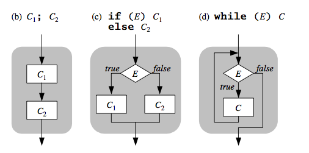

## Conceitos básicos das linguagens de programação


Os conceitos mais básicos das linguagens de programação são:


* Variáveis e armazenamento
* Amarração e escopo Comandos
* Expressões
* Comandos
* Sistema de tipos (próxima aula)


***

### Variáveis e armazenamento

De acordo com David Watt (2006):


- In functional/logic PLs (as in mathematics), a “variable” stands for a fixed but unknown value.
- In imperative/OO PLs, a variable is a container for a value, which may be inspected and updated as often as desired. Such a variable can be used to model a real-world object whose state changes over time.

Por exemplo, na linguagem Scala é possível usar estes dois conceitos de variáveis:

```scala
    val x = 10 // a variável x é imutável, não pode ser modificada
    var y = 20 // a variável y é mutável
    y = 30 // pode ser modificada
```

***

### Amarrações e escopo

Amarração é associação entre um identificador e uma entidade, tais como valores, variáveis e funções.

Três perguntas importantes


- Quais os símbolos e como posso compor para representar um identificador
- Quais as entidades que podem ser amarradas a um identificador
- Qual a validade da amarração no tempo e espaço.

O escopo de uma declaração (ou de uma amarração) é a porção do programa no qual ela tem efeito. 

- Em algumas linguagens antigas (tais como o Cobol), o escopo de cada declaração era todo o programa. 
- Nas linguagens modernas existe o conceito de bloco, e o escopo de cada declaração é controlada por esta estrutura.

Conceito adicional: tempo de amarração

***

### Expressões

Uma expressão é uma construção que pode ser avaliada para um dado valor: 


- Literais 
- Construtores
- Chamada de funções 
- Expressões condicionais

***

### Expressões: literais


O tipo mais simples de expressão são os literais, que denotam a valor fixo de um dado tipo:

* inteiro, 365
* float, 3.1416
* boolean, false
* caracter, '%'         
* string, "What?"

> Por que isso é importante ? Considere o programa abaixo, o que será impresso ?

```c
#include <stdio.h>

int main () {
  float a = 1.67;	   
  if (a == 1.67) {
	printf ("iguais\n");
  } else {
	printf ("diferentes\n");
  }
  return 0;
}
```

***

### Expressões: construtores

Construtor é uma expressão que constroem um valor composto a partir dos seus componentes. Por exemplo:

```c
//c
Point p = {10,20}
```

```java
//java
Point p = new Point (10,20)
```

```kotlin
// kotlin
val p = Point (10,20)
```

```Haskell
-- haskell
p = Point 10 20
```


***

### Expressões: Chamada de funções

Calcula um resultado aplicando uma função a seus argumentos.

Se uma função tem um único argumento, então uma chamada é tipicamente na forma

* `F(E)`, 
* ou apenas `F E`, 


Onde `F` determina a função ser aplicada, e a expressão E é avaliada para um determinada argumento.


***

### Expressões: Chamada de funções e operadores

Um operador é em essência uma função associada a um símbolo, e usada na notação infixa.

* Aplicar um operador unário `ϴ` é essencialmente uma chamada de função com um argumento.
  * `ϴ E`  é equivalente a `ϴ(E)`
* Aplicar um operador binário ϴ é essencialmente uma chamada de função com dois argumentos. 
  * `E1 ϴ E2` é equivalente a `ϴ(E1, E2)`

Desse modo, uma expressão aritmética é essencialmente composição de funções:
  * `a * b + c / d` equivale a
    `+(*(a, b), /(c, d))`


> Linguagens modernas, como Haskell, não diferencia operadores e funções. Scala permite associar simbolos aos métodos e funções, usando-os como operadores. No dialeto Lisp, todos os operadores são chamadas de funções no formato prefixo: `(* 5 (+ 2 5))`


***

### Expressões: Chamada de funções, operadores e ordem de avaliação

No caso da utilização da notação infixa, é necessário definir a ordem de avaliação dos operadores.

Exemplo:

`a + b * c`

Avaliar esta expressão da esquerda para a direita e da direita para a esquerda pode gerar resultados diferentes

As LPs devem definir uma ordem de precedência entre os operadores

Isto é feito através de regras de precedência de operadores

Nas linguagens, a ordem de precedência busca seguir a mesma da matemática, quando possível

|            | Ruby           | C                                | Ada            |
|------------|----------------|----------------------------------|----------------|
| Mais alta  | **             | ++ e -- posfixados               | **, abs        |
|            | + e – unários  | ++ e – préfixados, + e – unários | *, /, mod, rem |
|            | *, / e %       | *, / e %                         |                |
| Mais baixa | + e – binários | + e – binários                   |                 |
|||


Quando uma exp. possui dois operadores adjacentes com a mesma precedência, a ordem de avaliação é feita através das regras de associatividade da LP
* Mais à direita
* Mais à esquerda

Normalmente os operadores tem associatividade à esquerda, com exceção da exponenciação (à direita)


***

### Expressões: Chamada de funções e estrategia de avaliação

Existem duas estratégias de avaliação:

* Estratégia **call-by-value**: Avalia primeiro o argumento antes de aplicar a função (Pascal, C, Java, etc).

```
(\x -> x+1) (2+3)
= (x+1)+ 5
= 5+1
= 6
```

* Estratégia **call-by-name** (ou lazy evaluation): aplica imediatamente a função ao argumento, adiando para mais tarde a avaliação desse argumento (Haskell, Miranda, Scala ...)
  
```
(\x -> x+1) (2+3)
= (2+3)+1
= 5+1
= 6
```

***

### Expressões: Chamada de funções e operador de curto circuito

Uma avaliação em curto-circuito de uma expressão é tal que o resultado é determinado sem avaliar todos os operandos e operadores
Exemplo:

```
(13 * a) * (b / 13 - 1) // se a == 0...
(a >= 0) && (b < 10)
if ((a != NULL) && (a->x > 2) )
```

***


### Expressões: Expressões condicionais

Uma expressão condicional escolhe uma das suas subexpressões para ser avaliada, dependendo de uma condição.

* Uma if-expression a escolha é entre duas

  ```haskell
  -- haskell
  if x>y then x else y
  ```

ou 

```kotlin
    //kotlin
    val nota = 6.0
    val aprovado = if (nota >= 7.0) "aprovado" else "reprovado"
    println (aprovado)
```


* Uma case-expression a escolha  é entre várias.

```haskell
-- haskell
case m of
feb -> if isLeap y then 29 else 28
apr -> 30
jun -> 30
sep -> 30
nov -> 30
_ -> 31
```

ou

```kotlin
//kotlin
val x = 42
when (x) {
    0 -> println("zero")
    in 1..9 -> println("single digit")
    else -> println("multiple digits")
}
```

São mais comuns em linguagens funcionais, mas já é encontrada em linguagens mais recente. Em Kotlin as condições são sempre expressões, mesmo que pareçam comandos em alguns casos. Nesses casos, o tipo da expressão é `Unit`.


***

### Comandos

Comando (ou statement) é uma construção que irá ser executada para
atualizar variáveis e são característicos de linguagens imperativas.

* skips
* atribuições
* chamadas de procedimentos
* comandos sequenciais
* comandos de seleção
* comandos iterativos

***
### Comandos: skip


O skip é um comando com nenhum efeito. Exemplo:
* `;` em C and Java
* `null;` em Ada.
* `pass` em python
  

***
### Comandos: Atribuições

Este é o comando mais comum nas linguagens imperativas, e teu efeito é armazenar um valor em uma variável.

* Atribuição simples, o valor da expressão E é armazenada na variável V.

  * `V = E;` em C e Java
     ```c
     v = 10;
     ```
  * `V := E;` em Ada
    ```ada
     v := 10;
    ```

* Atribuição múltipla, o valor de E é armazenada em cada de V1,..., Vn.

  * `V1 = ... = Vn = E;` em C e Java
    ```c
     v1 = v2 = v3 = 10 ;
    ```
* Atribuição combinada com operador  binário:
  * `V (x)= E;` em C e Java significa o mesmo que: `V = V (x) E;`.
    * a += 10;
* Atribuições de tuplas em Python
  * V1,V2, ..., Vn = E1, E2, ..., En
    ```python 
        a, b, c, d = 10, 20, 30, 40
    ```

> Linguagens funcionais como Elixir, possuem pattern matching ao invés de atribuição. Então a seguinte execução faz uma associação do valor 1, ao símbolo x:
>
>```elixir
>  x = 1    
>```
> de modo que o seguinte código também seria válido:
>```elixir
>  1 = x    
>```
> que será valido, já que o interpretador irá conseguir casar os valores da esquerda e direita

***

### Comandos: Procedimento


* Procedimentos são coleções de sentenças que definem computações parametrizáveis
  * Podem modificar os parâmetros
  * Podem modificar variáveis globais
* Esta abstração existe apenas em linguagens imperativas.

> Funções são similares a procedimentos, mas são semanticamente modeladas como funções matemáticas, que não deveriam ter efeitos colaterais

***

### Comandos: Procedimentos

Em Ada, um procedimento tem a seguinte forma:

```Ada
procedure I (FPs) is
    D
begin
    C
end;
```
Onde:
* I é o identificador,
* FPS, são os parametros formais
* D, são as declarações locais
* C, corpo da função, um bloco de comando  


***

### Comandos: Procedimentos

A chamada de procedimentos tem a seguinte forma:

```
P(E1 , ... , En ); 
```

* Onde P determina o procedimento, e as expressões 
expressions `E1 , ... , En` são avaliadas para determinar os argumentos. 

Cada argumento pode ser avaliado:
 * para um valor (passagem por valor) ou  
 * para uma referencia (passagem por referência) para a variável;

***

### Comandos sequenciais

Entre controle de fluxos, o mais fundamental de todas é a sequencia, usada para explicitar que um dada comando C2 é executado após o comando C1. Em muitas linguagens uma sequencia é indicada por `;`. Por exemplo, uma sequencia de comandos de 1 a n é descrito da seguinte maneira:

```
C1; C2; ... ; Cn
```

Sequencias podem ser agrupadas como um comando composto, delimitado por palavras chaves ou símbolos. A linguagem C utiliza os símbolos `\{` e `\}`  para marcar o inicio e termino de um comando composto. O exemplo abaixo mostra um comando composto por uma sequencia de 3 comandos de atribuição. Observe que em C o `;` é requerido mesmo após o ultimo comando (linha 4).

```c
{ 
    a= 2;
    b = 4;
    c = a* b;
}
```

Sequencias são essenciais na construção de qualquer programa, mas não são suficientes para descrever qualquer problema. Quando escrevemos um programa, existem algumas ações que só serão executadas sob determinadas condições. Deste modo, é necessário uma segunda construção conhecida como comandos condicionais ou de seleção. 

### Comando de seleção

Estes comandos oferecem meios para escolher entre dois ou mais caminhos. A notação mais comum é o conhecido if .. then .. else, introduzido pela linguagem Algol 60. Usado em diversas linguagens, sua forma pode ser reduzida como a seguir: 

```
if  E then C1 else C2 endif
```

Onde `E` é uma expressão lógica, enquanto `C1` e `C2` são comandos. Informalmente, a semântica de tais comandos expressão uma alternativa a execução de um programa dado uma expressão lógica. Quando esta expressão é verdadeira o comando `C1` é executado, caso contrário o comando `C2` é executado. A clausula “else” é opcional, neste caso quando a expressão E for falsa nenhum comando é executado.

```
 if  E then C1 endif
```

A representação de múltiplos  caminhos é feita com um ou mais `if` aninhados (else if) como abaixo: 

```
if E1 then C1 
elseif E2 then C2 
... 
elseif E3 then Cn 
else Cn+1
endif
```

Em alguns casos múltiplos caminhos podem ser descritos por uma construção alternativa, conhecida como comando Case, que na sua forma mais simples é descrito como a seguir:

```
case E of 
    const1: C1; 
    const2: C2;
    ...
    constn: Cn; 
else Cn+1
```

Onde E é uma expressão cujo o valor é um tipo compátivel com as constantes `const1, const2, …, constn`, enquanto `C1, …, Cn+1` são commandos.  O tipo permitido para as contantes são usualmente tipos que permitem valores discretos, como inteiros e enumerados. 
Comandos de seleção permitem que em um dado momento apenas uma parte do programa seja executada de acordo com uma ou mais condições. Porém, existem momentos que precisamos que  um ou mais comandos sejam executado zero, uma ou mais vezes. Nestes casos é necessário usar um comando de iteração.  

### Comando Iteração

Sem iteração os programadores deveriam declara cada ação em sequencia; aumentando muito a quantidade de linhas de código. Além disso, os programas seriam inflexíveis pois a quantidade de ações a serem executadas deveria ser conhecidas.  Em geral os comandos de interação são compostos por duas partes, uma condição e um corpo que é composto por um ou mais comandos. Os comando do corpo são executando até que a condição seja falsa. A sua forma mais comum é com o uso do comando while, que também foi introduzido pela linguagem Algol:

```
while (E) do C
```

Onde (1) a expressão lógica E é avalidado, (2) caso seja verdadeiro o commando C é executado retornando para (1). Caso contrário o commando termina. Com este comando é possível então escrever qualquer programa. Porém, existem diversas outras variações. Por exemplo, a condição sendo  colocada após o comando: 

```
do C while (E)
```

Uma outra variação é usada quando a quantidade de vezes que um iteração será executada depender de um valor numérico, seja uma constante ou uma variável. Neste caso é usado uma construção um pouco distinta:
```
for I = inicio to fim by passo do corpo
```

Onde I é a variavel contadora; inico and fim são em geral valores inteiros; passo é uma constant que indica de quanto a variavel contadora sera incrementada a cada passot; corpo é o commando a ser repetido. O passo é usualmente um valor positivo, quando deseja que os valores do laço seja incrementado uma outra construção pode ser usada, onde é usada a palavra “downto” ao invés do “to”.
```
for I = inicio downto fim by passo do corpo
```

A linguagem C e varias outras que a sucedeu, optou por uma notação  mais flexível, onde sua forma geral é:
```c
for (exp1; exp2; exp3)
    ; // comandos
```

Onde  (1) avalia-se a exp1; (2) avalia a exp2, se o resultado for igual a zero a execução termina; (3) o corpo é executado; (4) avalia a expressão e volta para (2). Como são expressões, estas podem ser bem mais complexas tornando esta construção mais flexível. Além disso, deixa claro que esta é apenas uma abreviação para a construção While, como visto a seguir:

```c
for (i = initial; i <= final; i += step){ 
	body
}
```

É equivalente a:

```c
i = initial;
while (i <= final){
	body 
	i += step;
}
```
Estas três construções podem ser apresentadas graficamente pelos fluxogramas da Figura:



Fonte: (David Watt, Programming Language Concepts) 

Além desta a **programação estruturada** trouxe outras contribuições como o pensamento modularizado e abstração de dados, porém a discussão destas contribuições fica para um próximo texto.

