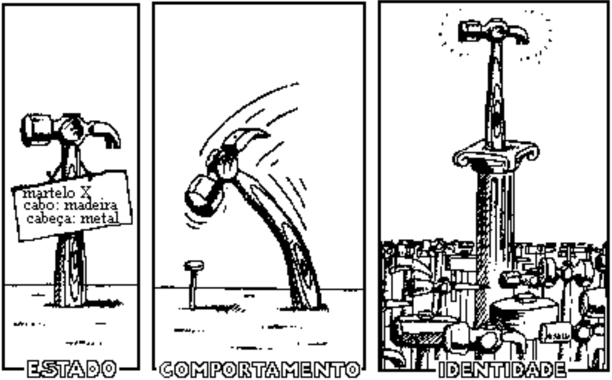
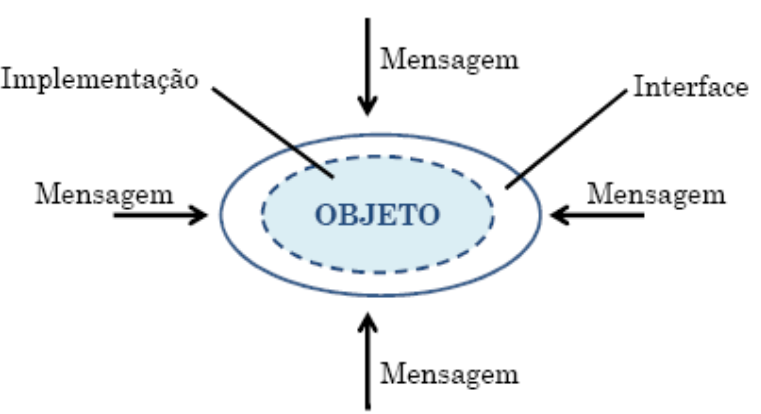
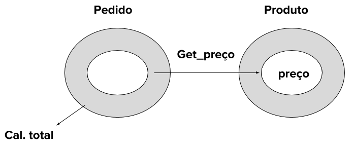
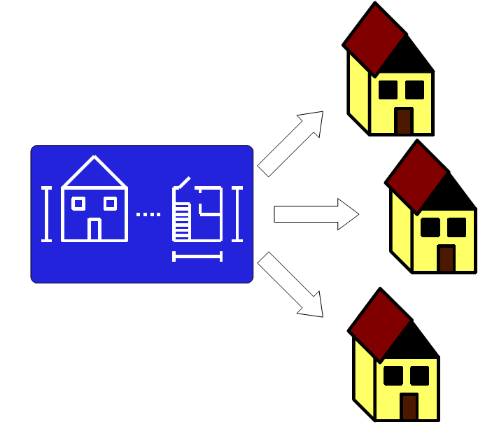

## Programação orientada a objetos

### Introdução

Um programa de computador é um conjunto de instruções que é interpretado e executado por um elemento de hardware, conhecido como processador. Porém dificilmente conseguiríamos construir os complexos sistemas atuais se pensássemos e modelássemos um programa deste modo. Ao invés disso, poderíamos pensar em um programa como um conjunto de procedimentos e os fluxos de dados entre estes, ou como a composição e aplicação de funções ou ainda como um conjunto de objetos identificáveis que possuem responsabilidades e colaboram entre si afim de alcançar um objetivo. A forma de pensar um programa afeta todo o seu ciclo de vida, desde a sua especificação a sua implantação.

Pensar programas como um conjunto de objetos é atualmente o paradigma dominante. Simula67 é considerada a primeira linguagem de programação que seguia este paradigma. Porém, este paradigma só passou a ser usada de forma mais ampla com o Smalltallk, Objective-c, C++ e Java.  Atualmente a orientação objetos, está presente em diversas outras linguagens, nativamente ou simulada. Para entendermos este paradigma, precisamos conhecer melhor seus principais conceitos como: **objetos**, **encapsulamento**, **classes**, **mensagem**, **herança** e **polimorfismo de inclusão**.


### Definição

Algumas definições sobre linguagens e programação orientada a objeto:

Em 1989, na OOPSLA (Object-Oriented Programming, Systems, Languages & Applications), diversos pesquisadores buscaram responder a perguntas como: o que é programação orientada a objeto, quais objetivos e origens. Essa discussão foi organizada na publicação: Peter Wegner - Concepts and Paradigms of Object Oriented Programming. Para tanto, eles focaram em trê conceitos:

* Objects are collections of operations that share a state.
* Classes serve as templates from which objects can be created.
* Inheritance allows us to reuse the behavior of a class in the definition of new classes.


Segundo Alan C. Kay (criador da linguagem smalltalk), em uma linguagem orientada a objetos [The Early History Of Smalltalk](http://worrydream.com/EarlyHistoryOfSmalltalk/):

1. Everything is an object
2. Objects communicate by sending and receiving messages (in terms of objects)
3. Objects have their own memory (in terms of objects)
4. Every object is an instance of a class (which must be an object)
5. The class holds the shared behavior for its instances (in the form of objects in a program list)
6. To eval a program list, control is passed to the first object and the remainder is treated as its message


Segund David Watt, 

    > "The program units of an object-oriented program are classes. Classes may be related to one another by dependency (operations of one class call operations of another class), by inclusion or extension (one class is a subclass of another class), or by containment (objects of one class contain objects of another class)."


### Principais conceitos de orientação a objetos em Java

#### Objetos


Um objeto pode ser visto como um elemento de um sistemas que é composto por atributos e métodos, sendo possível encontrar até pessoas que o referenciam como dados com métodos. Porém, esta é uma visão limitada de um objeto e não nos ajuda na fase de modelagem. Uma perspectiva interessante e definir um objeto como algo que tem uma responsabilidade. Esta responsabilidades concretizada pela ações ou métodos deste objeto. Além disso, um objeto é único e identificável, precisando ter informações do seu estado corrente, que são os **atributos** deste objeto (**ou variáveis de instância**). Esta visão é mais útil, pois ela deixa claro o objetivo de um objeto dentro de sistema. Com isso chegamos na definição usado no inicio do texto, onde eu descrevia um sistema, como um conjunto de objetos únicos e identificáveis que possuem responsabilidades e que colaboram entre si afim de alcançar um objetivo. Pensar em objetos deste modo tende melhorar duas características importantes de componentes de software: **coesão** e **acoplamento**. Se um objeto tem uma única (ou poucas) responsabilidades existe uma grande tendência que as suas operações estejam estreitamente ligadas, ou seja, alta coesão. Do mesmo modo, dado que cada objeto tem a sua respectiva responsabilidade, existe também uma tendencia que exista um baixo acoplamento. Estas duas características tornam este paradigma eficaz para o desenvolvimento de componentes reutilizáveis.

Em resumo um objeto requer:

- **Estado**: Implementado através de um conjunto de propriedades (atributos).
- **Comportamento**: Define como um objeto reage às requisições de outros objetos.
- **Identidade única:** Propriedade que distingue um objeto de outros objetos.





#### Mensagens

Para que um objeto possa executar sua responsabilidade, é necessário existir uma interface pública que permita a sua comunicação com os demais objetos. A comunicação é feita através de troca de mensagens, que no nível de implementação são as chamada aos **métodos públicos**, ou seja, os métodos visíveis por todos os demais objetos do sistema. 





Um objeto não pode ser tratado como dado, a modificação de qualquer estado requer passar por mensagens.  As mensagens identificam os métodos a serem executados no objeto receptor. Para invocar um método de um objeto, deve-se  enviar uma mensagem e para enviar uma mensagem é necessário:

- identificar o objeto que receberá a mensagem
- identificar o método que o objeto deve executar
- passar os argumentos requeridos pelo método





#### Classes


Um objeto é uma entidade única dentro de um sistema, porém usualmente temos um conjunto de objetos que compartilham características. Por exemplo, um sistema acadêmico manipulará informações de um conjunto de estudantes que terão características comuns dentro deste sistema. Estas características comuns são usualmente agrupadas dentro de uma classe, que define:

- Os elementos de dados que o objeto contém
- Os métodos que o objeto pode utilizar
- A maneira como esses elementos de dados e métodos podem ser acessados.

**Definição de classe:** "A class is a family of objects with similar variable components and methods" (David Watt).    As Classes são como fábricas de objetos. Você constrói um novo objeto de uma classe com operador new. Logo podemos dizer que cada objeto é uma instância de uma dada classe.





> A grande maioria das linguagens orientadas a objetos são baseadas em classe, como C++, Java e Swift. Porém, segundo alguns autores o uso de conceito de classes não é imperativo para o desenvolvimento orientado a objeto, linguagens como JavaScript (antes da versão 6) e Lua dão suporte a orientação a objeto através de um conceito chamada prototype (não será detalhado aqui). 

As diferenças dessas duas abordagens são tratadas em: [Object-Oriented Programming Languages: Interpretation](https://www.springer.com/gp/book/9781846287732)

> "The two main approaches found in object-oriented programming languages are, respectively, class-based and prototype-based languages. Class-based lan guages are exemplified by Smalltalk, C++ and Java ...

With the second approach, the prototype-based approach, matters are different. According to the prototype-based approach, objects are created by means of a copy operation (called cloning) which is applied to a prototype. Prototypes define stereotypical objects. A clone of a prototype replicates the structure of that prototype. Prototypes can be copied and modified to produce new prototypes that can then be cloned to form new objects."

> Vamos focar aqui nas linguagens baseadas em classes e estaticamente tipadas

Para exercitar o conceito de classes, considerem uma classe simples, que contém apenas um método.

```java
    class Greeter { 
       public String sayHello(){
          String message = "Hello, World!";
          return message;
       }
    }
```
Uma classe teste constrói um ou mais objetos da classe que está sendo testada, e invoca os métodos a serem testados.


```java
    class GreeterTest {
    
       public static void main(String[] args){
          Greeter worldGreeter = new Greeter();
          System.out.println(worldGreeter.sayHello());
       }
    }
```

**Variáveis de instância**

Um objeto utiliza variáveis de instância para armazenar seu estado.
O estado de um objeto é o conjunto de valores que determina como um objeto reage às chamadas de métodos. Sem variáveis de instância, os objetos iram responder iguais:


```java
    Greeter greeter1 = new Greeter();
    Greeter greeter2 = new Greeter();
```

Criando e utilizando uma variável de instância:


```java
    class Greeter{
       private String name;
       //constructor
       public Greeter (String aName) {name = aName; }
       public String sayHello(){
          String message = "Hello, " + this.name + "!"; 
          return message;
      }
    }
```

> **Variáveis de instância**  vs **variáveis locais**: No exemplo anterior,  foi definida uma variável local (message) dentro do método  sayHello, então ela só pode ser acessada dentro deste método. A variável de Instância (name) pertence a um objeto, podendo ser utilizada em todos os métodos de sua classe.

**Construtores:**

- Os construtores contém instruções e parâmetros para inicializar objetos, ou seja, modificar o seu estado.
- O nome do construtor é sempre igual ao nome da classe.
- Pode haver mais de um construtor, desde que tenha parâmetros distintos, isso se chama sobrecarga.
- O operador new invoca o construtor.

Instanciando dois objetos distintos:


```java
    Greeter worldGreeter = new Greeter("World");
    Greeter sergioGreeter = new Greeter("Sergio");
```

Lembrando que construtores não são métodos, eles não tem tipo de retorno e não se pode invocar um construtor sobre um objeto existente.


```java
    public Greeter(String aName){
       this.name = aName;
    }

```

#### Encapsulamento

Em orientação objetos, os métodos e os atributos de um objeto podem estar em três níveis de acesso: **público**, **protegido** e **privado**. Usualmente, os atributos de um objeto são privados, a interface é o único meio de comunicação do objeto com o sistema. 

Desta forma, os atributos (ou dados) estão protegidos, ocultos do sistema, o que diminui o acoplamento deste objeto com o sistema. Esta capacidade de ocultar elementos é conhecida como encapsulamento e teve como influência o conceito de tipo abstrato de dados. Um tipo abstrato de dados é um conceito matemático que diz respeito a determinada entidade e às funções aplicadas sobre ele. Um TAD é definido pela sua funcionalidade: “o que” se pode fazer com ele, e não “como” ele está implementado. Por exemplo uma fila é um tipo abstrato de dados: pode-se inserir e retirar elementos de uma fila, verificar se a fila está cheia ou vazia, ou ainda contar quantos elementos estão nesta fila. A utilização da fila (por uma aplicação) é realizada através destas funções independe da sua implementação. Outros exemplos de tipos abstrato de dados:

- Pilha:  pop, push, top
- Conta bancária:  depositar,  sacar , tirar extrato, verificar saldo
- Agenda: inserir, remover, alterar
- Figura: desenhar, mover, rotacionar, colorir

Veja a definição em: [J.V. Guttag, Abstract Data Types and the Development of Data Structures](http://www.unc.edu/~stotts/comp723/guttagADT77.pdf)

Em geral, em linguagens baseadas em classe, elas podem ser entendidas como um tipo abstrato de dados.  Segundo o livro (Code Complete 2, Microsoft) é muito importante compreender o conceito de tipo abstrato de dados para construir classes.


> “Abstract data types form the foundation for the concept of classes. In languages that support classes, you can implement each abstract data type as its own class. Classes usually involve the additional concepts of inheritance and polymorphism. One way of thinking of a class is as an abstract data type plus inheritance and polymorphism”
    
> “Understanding ADTs is essential to understanding object-oriented programming. Without understanding ADTs, programmers create classes that are “classes” in name only—in reality, they are little more than convenient carrying cases for loosely related collections of data and routines. With an understanding of ADTs, programmers can create classes that are easier to implement initially and easier to modify over time”


Para criar tipos abstrato de dados, a linguagem precisa dar suporte a encapsulamento, que pode ser definido como uma técnica para minimizar as interdependências entre “módulos''. 

Em Java in Nutshell:

> "Encapsulation is one of the important object-oriented techniques is hiding the data within the class and making it available only through the methods. Why would you want to do this?"

Os autores continuam explicando as vantagens:

- The most important reason is to hide the internal implementation details of your class. If you prevent programmers from relying on those details, you can safely modify the implementation without worrying that you will break existing code that uses the class.
- Another reason for encapsulation is to protect your class against accidental or willful stupidity. A class often contains a number of interdependent fields that must be in a consistent state. 


> When all the data for a class is hidden, the methods define the only possible operations that can be performed on objects of that class. Once you have carefully tested and debugged your methods, you can be confident that the class will work as expected. On the other hand, if all the fields of the class can be directly manipulated, the number of possibilities you have to test becomes unmanageable (java in nutshell).


Em resumo, podemos dizer que o encapsulamento é uma técnica para minimizar as interdependências entre módulos escondendo seus atributos e métodos e protegendo os atributos dos objetos de serem corrompidos por outros objetos

**Modificadores de Acesso**


- All the fields and methods of a class can always be used within the body of the class itself. 
- Java defines access control rules that restrict members of a class from being used outside the class.
- This public keyword, along with protected and private, are access control modifiers; they specify the access rules for the field or method.

Em Java, a tabela a seguir apresenta as regras:

| **Modifier**  | **Class** | **Package** | **Subclass** | **World** |
| :------------ | :-------- | :---------- | :----------- | :-------- |
| **public**    | Y         | Y           | Y            | Y         |
| **protected** | Y         | Y           | Y            | N         |
| **default**   | Y         | Y           | N            | N         |
| **private**   | Y         | N           | N            | N         |

> O **default** refere-se a quando não é definido nenhum modificador.

### Laboratório

1. Crie as seguintes classes que representa um simples sistema acadêmico
(Referênca: Apostila k9)

    - Implemente uma classe chamada Aluno para definir os objetos que
    representarão os alunos de uma escola. Essa classe deve declarar
    três atributos: o primeiro para o nome, o segundo para o RG e o
    terceiro para a data de nascimento dos alunos.

    - Faça uma classe chamada TestaAluno e crie dois objetos da classe
    Aluno atribuindo valores a eles. A classe também deve mostrar na
    tela as informações desses objetos.

    - Em uma escola, além dos alunos temos os funcionários, que também
    precisam ser representados em nossa aplicação. Então implemente
    outra classe chamada Funcionario que contenha dois atributos: o
    primeiro para o cargo e o segundo para o salário dos funcionários.

    - Faça uma classe chamada TestaFuncionario e crie dois objetos da
    classe Funcionario atribuindo valores a eles. Mostre na tela as
    informações desses objetos.

    - Em uma escola, os alunos precisam ser divididos por turmas, que
    devem ser representadas dentro da aplicação. Implemente uma classe chamada Turma que contenha quatro
    atributos: o primeiro para o período, o segundo para definir a
    série, o terceiro para sigla e o quarto para o tipo de ensino.

    - Faça uma classe chamada TestaTurma para criar dois objetos da classe
    Turma. Adicione informações a eles e depois mostre essas informações
    na tela.


2. No exercício anterior, usamos classes de teste. Essa abordagem é mais prática e simples, quando ainda estamos aprendendo. Porém, é importante nos habituarmos a usar frameworks de teste de unidade, como o Junit do Java. Para experimentar o Junit, execute o tutorial [“Sua primeira classe Java”](https://ibm.co/2NsnsYf). Caso precise, no mesmo link acesse “Introdução ao Eclipse” para conhecer um pouco mais sobre o Eclipse.

3. Modelem, codifiquem e testem quatro classes que representam formas
geométricas: a) Ponto, b) Retângulo, c) Circulo e d) Segmento de reta
(delimitada por um ponto inicial e final). Modelar, significa
identificar o que será público, protegido ou privado, quais métodos mais
importantes, e construtores. Para testar, podem usar classes de teste ou
o framework JUnit.

