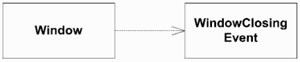
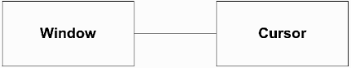
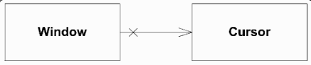
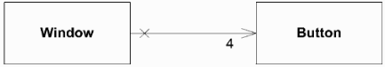
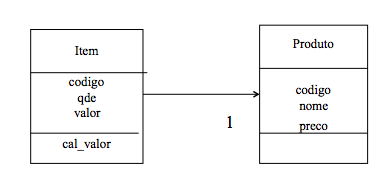
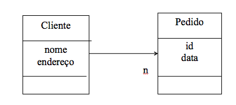
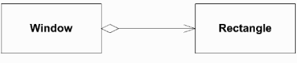
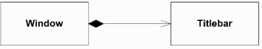
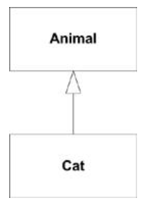

## Relações


(Based in Dan Pilone. “UML 2.0 in a Nutshell.”)

Dado que um programa orientado a objeto é uma coleção de objetos que se interagem e se comunicam através de mensagens. Logo é necessário definir as suas relações. De acordo com (Pilone) existem diversos tipos de relações, aqui vamos tratar dos seguintes:  dependência, associação, composição, agregação e generalização.


### Dependência (usa um)

Este é o tipo de relacionamento mais fraco, já que é usualmente transiente, não é mantido durante toda a vida de um objeto. Por exemplo, uma classe Window pode "usar” uma classe WindowEvent para notificar seus eventos, como o fechamento de janela. Em um diagrama de classes esse relacionamento é representado por linhas tracejadas.




E essa relação ocorre usualmente dentro de métodos, com o objetivo de utilizar algum serviço de um dado objeto.


### Associação (tem um)

(texto do livro UML in nutshell)

"Associations are stronger than dependencies and typically indicate that one class retains a relationship to another class over an extended period of time. Are typically read as "...has a...". 

“For example, if you have a class named Window that has a reference to the current mouse cursor, you would say "Window has a Cursor". .”

“You show an association using a solid line between the classes participating in the relationship.”




**Navegabilidade**

“Associations have explicit notation to express navigability. If you can navigate from one class to another, you show an arrow in the direction of the class you can navigate to. ” 

“Because you can’t navigate from an instance of Cursor to an instance of Window, we explicitly show the navigability arrow and an X where appropriate.”





**Cardinalidade (multiplicity)**

You can express how many instances of a particular class are involved in a relationship. 

You don’t specify a value, a multiplicity of 1 is assumed. To show a different value, simply place the multiplicity specification near the owned class.





Exemplo de associação 1 para 1:




Código:


```java
    public class Item {
      ...
      public Item(int c, int q, Produto p){
          codigo =c;
          qde = q;
          prod = p;
       } 
       public double cal_valor(){
                valor = qde * prod.get_preco();
       }
    }
    
    public class Produto {
        private int codigo;
        private String nome;
        private float preco;
        public Produto(int c, String n, float p){
            codigo=c;
            nome=n;
            preco=p;
        }
        public double get_preco(){
            return preco;
        }
    }
```
Uma associação de 1 para muitos:




Código:

```java

import java.util.Vector;
public class Cliente{
    private String nome;
    private String endereco;
    private Vector ped;
     public Cliente(String n,String e){
                nome=n;
                endereco=e;
                ped=new Vector();
     }
    public int get_size(){
            return ped.size();
    }
    public void add_pedido(Pedido p){ ped.addElement(p); }
    public Pedido get_pedido(int i){ 
        return (Pedido)ped.elementAt(i); 
    }
    
    public void exc_pedido(int id){
                Pedido aux;
                int tam=ped.size();
                for(inti=0;i<tam;i++){
                        aux=(Pedido)ped.elementAt(i);
                        if(aux.get_id()==id){
                                ped.removeElementAt(i);
                        }
                }
        }
    }
```
**Agregação**

Is a stronger version of association. Unlike association, aggregation typically implies ownership and may imply a relationship between lifelines. 

Aggregations are usually read as "...owns a...". For example, if you had a classed named Window that stored its position and size in a Rectangle class, you would say the "Window owns a Rectangle.” 

In the association example, Window doesn’t own the Cursor; Cursor was shared between all applications in the system.”





**Composição**

Composition represents a very strong relationship between classes, to the point of containment. 

Composition is used to capture a whole-part relationship. 

The lifetime of instances involved in composition relationships is almost always linked; if the larger, owning instance is destroyed, it almost always destroys the part piece.





## Generalização (é um)

Quando duas classes se relacionam através do que é comumente chamado de herança, quando uma classe mais geral (super classe) é especificado através de subclasses.

“You show a generalization relationship with a solid line with a closed arrow, pointing from the specific class to the general class. Figure shows an example of the Cat to Animal
This comprehensive new edition not only provides a quick-reference to all UML 2.0 diagram relationship”.





Esse tipo de relação envolve outros conceitos e serão detalhados na próxima seção.


### Laboratório


Codifique um sistema composto por quatro classes principais: SocialNetwork, User, Post e Comment. Sendo que a SocialNetwork é composta por uma coleção de User, cada User possui uma coleção de Post, e cada Post uma coleção de comentários. O sistema deverá responder ao seguinte programa teste:


```java
// Programa teste
public class SocialNetTest {
public static void main(String [ ] args) {
 
SocialNetwork rede = new SocialNetwork ();

rede.addUser (new User ("u1", "Joao Carlos") );
rede.addUser (new User ("u2", "Maria Antonia") );
rede.addUser (new User ("u3", "Emanuel Benedito") );
rede.addUser (new User ("u4", "Josefina de Almeida") );

// adiciona uma amizade, dado dois user ids
rede.addFriendly ("u1", "u2")
rede.addFriendly ("u1", "u3")
rede.addFriendly ("u2", "u4")

// adiciona um post, dado um usuário e uma mensagem
rede.addPost ("u1", new Post ("p1", "Tomando cafe"))
rede.addPost ("u2",new Post ("p2", "amizade é tudo de bom ") )
rede.addPost ("u2", new Post ("p3", "passeando com meu cachorro"))

// um usuario (u3) adicionado um comentario ao post p3 do usuario u2
rede.addComment ("u3", "u1", "p1", new Comment ("c1", 
                            "Com pão de queijo ? tudo di bão") )
// um usuario u4, curtiu o post p2, do usuario u2
rede.liked ("u4", "u2", p2)

// imprime todos os post, por usuario, e os comentarios de cada post
rede.printUpdates()
 } 
}

```