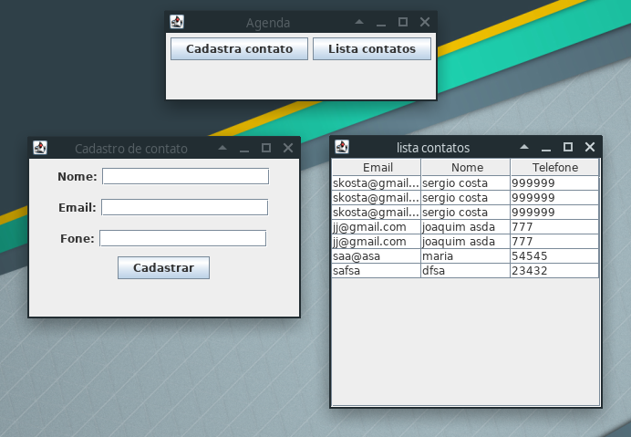

## Model View Control

### Atividade valendo nota

Desenvolva uma tela de cadastro e outra tela para visualização de dados, usando como base a arquitetura utilizada em sala de aula. 

O código pode ser acessado em:

https://github.com/profsergiocosta/pp20191/tree/master/src/javaexemplos/src/main/java/br/ufma/ecp/paradigmas/aulajtable

As telas seriam bem simples, a partir de uma tela principal, tem dois botoões,  um para cadastro e outro para listar os dados.

Na tela de visualização será possível editar e excluir algum dado existente. Então, na tela de visualização será necessário incluir um botão para excluir.

Lembre, que ainda iremos usar esse projeto para uma atividade sobre metaprogramação.

