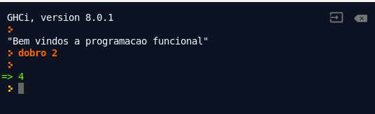
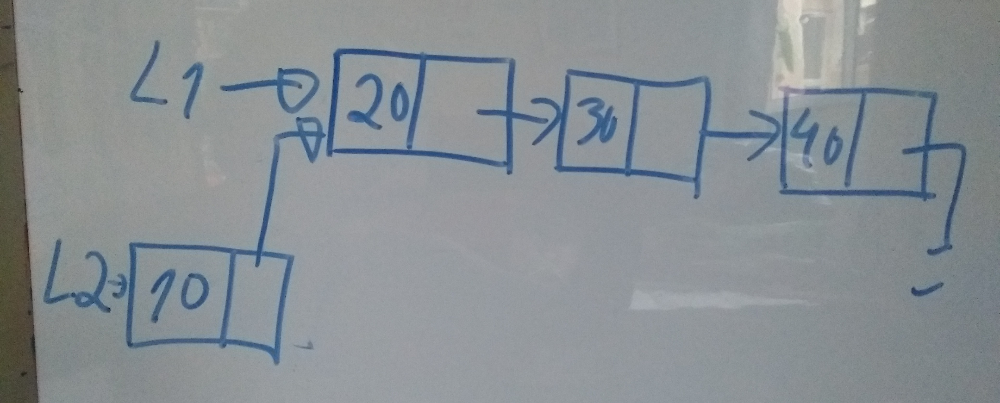

## Introduçao a programação funcional 


Nos últimos anos a programação funcional tem ganhado um destaque maior nas soluções de mercado. Porém, é importante distinguir a programação funcional, das linguagens funcionais. A programação funcional é um paradigma de programação, ou seja, um estilo de programação que utiliza alguns conceitos chaves @watt1990programming. Então quais seriam estes conceitos chaves ? Para responder essa pergunta, Martin Odersky o criador da linguagem Scala, distingue duas visões, uma mais restrita e outra mais ampla.

-   Wider sense, programar com foco nas funções, e nas suas composições.

-   Restricted sense, programar sem efeitos colaterais.

A primeira visão é mais ampla, englobando linguagens como Scala, Python, Ruby, Swift, Lua, JavaScript e PHP. Estas linguagens são também consideradas híbridas, já que permitem a programação imperativa. A segunda visão é mais restrita e tende a excluir as linguagens com suporte a programação imperativa, considerando apenas a linguagens puramente funcionas como o Haskell. Porém, mesmo em linguagens que tem suporte a programação imperativa é possível programar grande parte de um sistema sem efeitos colaterais com algum esforço adicional.

Agora, iremos ver o que significa programar sem efeitos colaterais, e programar com foco nas funções.

### Programar com foco nas funções


Quando se pensa em programar com foco nas funções, existe um risco de acreditar que programação funcional é o mesmo que programação “procedural” ou estruturada. Linguagens como C e Pascal constroi sistemas como uma coleção de funções ou procedimentos que são aplicados a uma coleação de dados. De fato tanto o paradigma funcional quanto o estruturado tem bases matemáticas com algumas similaridades. Por exemplo, em @cardelli1984semantics, Luca Cardelli em 1984 destacava os fundamentos matemáticos da programação estruturada ao compará-la com a orientação objeto que teria fundamentos mais baseados na biologia e taxonomia:

> *"There are two major ways of structuring data in programming languages. The first and common one, used for example in Pascal, can be said to derive from standard branches of mathematics. Data is organized as cartesian products (i.e. record types), disjoint sums (i.e. unions or variant types) and function spaces (i.e. functions and procedures). The second method can be said to derive from biology and taxonomy. Data is organized in a hierarchy of classes and subclasses, and data at any level of the hierarchy inherits all the attributes of data higher up in the hierarchy.*

Por este ponto de vista, a programação estruturada teria de fato algumas similaridade com a programação estruturada. Porém, para programar com foco nas funções, elas são usualmente escritas através de uma sintaxe simples. Por exemplo, uma função dobro em Haskell seria definido da seguinte maneira:

```haskell
dobro x = 2 * x
```

Compare essa definição de função com outras linguagens, como Ada, Pascal, C e até mesmo com linguagens dinâmicas e modernas como Python.

```haskell
def dobro (x) :
    return 2 * x
```

Caso não tenha o Haskell instalado, experimente-o através do seguinte link: <https://repl.it/@profsergiocosta/haskellexemplo1>. A chamada de uma função também é simples, basta passar o nome da função e os parâmetros de entrada sem usar parênteses e nem virgulas. Por exemplo, acessando o *repl.it* podemos entrar no terminal com:



Para entendermos melhor a chamada de funções, considerem a função `max` que dado dois valores ela retorna o maior deles. Por exemplo, usando no repl.it ou em um terminal iterativo:

    GHCi, version 8.6.2: http://www.haskell.org/ghc/  :? for help
    Prelude> max 8 9
    9

Essa função não é capaz de calcular o maior valor de dado três numeros, por exemplo:

    Prelude> max 9 7 5

    <interactive>:2:1: error:
        • Non type-variable argument in the constraint: Ord (t1 -> t2)
          (Use FlexibleContexts to permit this)
        • When checking the inferred type
            it :: forall t1 t2. (Ord (t1 -> t2), Num t1, Num (t1 -> t2)) => t2

No desenvolvimento destes livro, entenderemos melhor essa mensagem de erro, por enquanto considere que ela está dizendo que a função recebe apenas dois argumentos. Então, eu poderia querer criar uma nova função que recebe dois argumentos da seguinte maneira (experimente em <https://repl.it/@profsergiocosta/haskellexemplo2>):

```haskell
maior3 a b c = max a (max b c)
```

Observem que neste caso, os parenteses são essenciais, caso contrário a linguagem iria entender que estavamos passando quatro parâmetros ao invés de 2. Por exemplo, no caso a seguir equivale aplica função `max` aos valores: 10, `max`, 5 e 12.

    Prelude> max 10 max 5 12

    <interactive>:3:1: error:
        • Non type-variable argument in the constraint: Ord (a -> a -> a)
          (Use FlexibleContexts to permit this)
        • When checking the inferred type
            it :: forall a.
                  (Ord a, Ord (a -> a -> a), Num a, Num (a -> a -> a)) =>
                  a

Para evitar o uso de parênteses é comum o uso do operador `$`, como na versão abaixo:

```haskell
maior3 a b c = max a $ max b c
```

Isso ocorre por que as funções são consideradas como **valores de primeira classe**. Em inglês é comum o termo *first class citzen*. Isso significa que as funções são valores como qualquer outro dentro da linguagem, podendo ser passadas como parâmetros ou retornadas por outras funções. Além de poderem fazer parte de outras estruturas, por exemplo, uma lista de funções. Essa característica é muito importante para uma linguagem dar suporte a programação funcional. Considerem a seguinte função:

```haskell
repete f x = f $ f x 
```

Testando o código em <https://repl.it/@profsergiocosta/haskellexemplo3>. Podemos aplicar a função `repete` a função `dobro` e o literal `4`.

    Prelude> repete dobro 4
    16

A função `repete` recebe uma função como se fosse um valor como qualquer outro. Porém, observe que o segundo parâmetro é uma literal, ou seja, o valor 4 não está amarrado a nenhuma variável ou definição. Como funções são valores de primeira classe, é necessário que estas linguagens dê suporte a criar funções do mesmo modo. Este tipo de função é denominada de **função anônima** ou apenas de **lambda** em referência ao cálculo lambda. Em Haskell podemos criar e chamar uma função lambda como a seguir:

    Prelude> (x -> 2 *x) 5
    10

Voltando ao exemplo anterior, podemos agora passar uma **função anônima** para a função repete:

    Prelude> repete (x -> 2 * x) 4
    16

**Funções anônimas** são muito úteis para serem aplicadas nas **funções de alta ordem**, que são funções que recebem outras funções como parâmetros de entrada. A função `repete` definida anteriormente é um exemplo. Porém, existem outras funções de alta ordem mais úteis. O “trio” são as funções `map`, `filter` e `foldr` . Esta última é chamada de `reduce` em outras linguagens funcionais, sendo essa a origem da denominação da arquitetura *map-reduce*.

A função `map` é usada para aplicar uma dada função a todos os elementos de uma lista. Por exemplo, dado uma lista de `strings` retornamos uma lista de inteiros com o tamanho de cada `string`.

    Prelude> map length ["ola","programa", "funcional"]
    [3,8,9]

Veremos na Seção XX os fundamentos para a função `map` e como ela pode ser aplicada a outros tipos de dados além de listas.

Outra função muito útil é foldr, que permite reduzir uma coleção de valores a um único valor dado uma função binária, como a `(+)`, `(*)` ou `max`.

    Prelude> foldr (+) 0 [1,2,3,4,5]
    15
    Prelude> foldr (*) 1 [1,2,3,4,5]
    120
    Prelude> foldr max 0 [1,2,8,4,5]
    8

A função `filter` é outra função de alta ordem muito útil. Ela recebe um predicado e retorna uma nova lista apenas com os valores que atendem aquele predicado. Por exemplo, considere que tenha um texto de algum artigo em inglês e queremos ignorar palavras como preposições e artigos. A lista de palavras a serem ignoradas podem ser colocadas em uma lista. Então, podemos escrever o código abaixo que filtra apenas as palavras que não estão em ignore. Testem em <https://repl.it/@profsergiocosta/haskellexemplo4>.

```haskell

ignore = ["OF","THE","TO","A","AN","AND","OR","FOR"]

text = "Of all the adaptations that allow our animal brethren to soar through the air or endure the darkness and crushing pressure  ..."

textFilter = 
  filter  (flip notElem ignore ) 
  $ words 
  $ map toUpper text

main = print textFilter
```

Outra característica comum em programação funcional é a utilização de **casamento de padrões** e `guards` ao invés de estruturas condicionais. Por exemplo, o Haskell utiliza os símbolos `&&` para o operador lógico `e`. Porem, podemos criar facilmente a função lógica `e` usando **casamento de padrões**:

```haskell
e False _ = False
e True x  = x
```

Lembre-se que para o operador `e` falso e qualquer outra coisa é sempre falso. Usamos o carácter curinga `_` para representar o “qualquer coisa”. Quando o primeiro parâmetro for True, o resultado irá depender do segundo parâmetro.

Casamento de padrões são usados quando queremos que a função case com um valor específico. Porém, quando estamos querendo que a função identifique alguma condição, usa-se os **guards**:

```haskell
aprovado nome nota
  |nota >= 7 = nome ++" está aprovado"
  |otherwise = nome ++ "está reprovado"
```

Com este exemplo, apresentamos brevemente os seguintes conceitos: guards, casamento de padrões, funções de alta ordem, funções anônimas e funções como valores de primeira classe. Estes conceitos estão presentes em diversas linguagens e são muito úteis para programar com foco nas funções.

### Programar sem efeitos colaterais


Uma visão mais restrita, define que em um programa funcional é definido por funções que aplicadas a **valores imutáveis** produzem novos valores. As funções não deveriam causar nenhum **efeito colateral**, como uma operação de entrada e saída ou alteração de valores de uma variável. Quando uma função tem um efeito colateral ela deixa de ser uma **função pura** e perde a **transparência referencial**. Isso significa que ela nem sempre retorna o mesmo valor, dado a mesma entrada. Por exemplo, considere o seguinte código em Python:

```python
l = [4,5,6,8,9]

def somaComTopo (x):
  return x * l.pop(0)

print(somaComTopo(4))
print(somaComTopo(4))
print(somaComTopo(4))
```

Todas as três chamadas a função `somaComTopo` irá retornar um valor diferente, dado que existe um **efeito colateral** que é a alteração do estado de uma lista global `l`. Em programação funcional as **estruturas de dados são imutáveis**, como `Listas`, `Tuplas` e `Strings`. Essa restrição pode parecer estranha para alguém acostumado com programação imperativa. Porém, lembre-se que mesmo no Python as `Tuplas` e `Strings` são imutáveis. De modo similar as `String` em Python, não é possível adicionar um novo elemento a uma lista em Haskell. Ao invés disso, cria-se uma nova lista como no programa a seguir:

```haskell
l1 = [20,30,40]
l2 = 10 : l1
```

Neste exemplo, a lista `l1` segue sem alteração e a lista `l2` tem os valores de `l1` mais o valor `10` no início da lista. Em um primeiro momento, pode parecer que existe um desperdício de memória. Porém, isso não é verdade dado que os valores não estão replicados na memória, dado que `l2` compartilha os mesmos valores com `l1`. Na memória seria algo assim:



**Funções puras** são ideias para testes, pois não é necessário considerar durante os testes os possíveis estados do programa. As funções podem ser testadas isoladamente, e ao inserí-las no sistema já sabemos que ela não irá afetar o estado do programa e gerar passíveis erros em outras partes do programa. Além disso as estruturas imutáveis são ideais para a paralelização, já que não existe compartilhamento de estado.

Com a ausência de variáveis mutáveis, não é possível a utilização de estruturas de iteração. Usa-se nestes casos as funções de alta ordem ou **funções recursivas** explicitamente. Para exemplificar uma função recursiva, vamos usar o clássico exemplo.


Essa definição da função fatorial pode ser escrita em Haskell usando funções recursivas e casamento de padrões:

```haskell
fat 0 = 1
fat n = n * fat (n-1)
```

Ou usando funções de alta ordem:

```haskell
fat n = foldl (*) 1 [1..n]
```

As funções recursivas são muito criticadas na literatura. Em partes essa crítica é razoável, dado o consumo de memória que pode levar ao erro conhecido como “stack overflow”. Contudo, existem diversas técnicas que podem evitar esse tipo de erro, como por exemplo a recursão em cauda. O algorimo de fibonacci é muito usado como um exemplo ruim de recursividade. Essa implementação é bem simples, porém tem um custo alto, além de consumir muito tempo.

```haskell
fib :: Integer -> Integer
fib 0 = 1
fib 1 = 1
fib x = fib (x - 1) + fib (x - 2)
```

Com algumas modificações, podemos fazer uma nova versão que é capaz de imprimir facilmente o milésimo fibonnacci.

```haskell
fibTuple :: (Integer, Integer, Integer) -> (Integer, Integer, Integer)
fibTuple (x, y, 0) = (x, y, 0)
fibTuple (x, y, index) = fibTuple (y, x + y, index - 1)

fibEf :: Integer -> Integer
fibEf x =  r
  where
  (r,_,_) = fibTuple (0, 1, x) 

main = print $ fibEf 1000
```

A execução do código acima retornaria o seguinte número:

    4346655768693745643568852767504062580256466051737178040248172908953655541794
    90518904038798400792551692959225930803226347752096896232398733224711616429964409
    06533187938298969649928516003704476137795166849228875

Assim apresentamos brevemente os principais conceitos para programação funcional: a) funções como valores de primeira classe, (b) funções anônimas, (c) funções de alta ordem, (d) casamento de padrões, (e) guards, (f) valores imutáveis, (g) função pura, (h) transparência referencial, (i) efeito colateral e (j) funções recursivas. Porém, em seções futuras estes conceitos serão bem detalhados.


### Histórico das linguagens


Atualmente a maioria das linguagens de programação dão suporte ao estilo funcional. Na linha do tempo abaixo destaco algumas das influentes linguagens de programação que são primariamente funcionais.

-   1959 Lisp

-   1975-77 ML, FP, Scheme

-   1978 Smalltalk

-   1985 Miranda

-   1986 Standard ML

-   1990 Haskell, Erlang

-   2000 OCaml

-   2003 Scala

-   2005 F#

-   2007 Clojure

-   2011 Elixir

Lisp criada em 1959 influenciou diversas linguagens e possui hoje diversos dialetos, como o Scheme e mais recente o Clojure. Além de Lisp, ML é outra linguagem muito influente, tem dialetos como o OCaml e F#. Além disso, influenciou linguagens como Miranda, Haskell, Erlang e Scala.

## A linguagem Haskell


Este texto tem como objetivo apresentar os conceitos de programação funcional, porém a partir desta Seção [pf:tiposfuncoes] iremos usar principalmente a linguagem Haskell para apresentar em mais detalhes estes conceitos.

“Haskell was developed as a common open source platform for research in functional language design. One of its more distinctive features is its rich type system. Although foremost a research tool, Haskell has found a home in commercial applications, including Facebook’s anti-spam programs.”

### Puramente funcional


Haskell é considerada uma linguagem puramente funcional, ou seja, ela não possui elementos de programação imperativa, como em Clojure, Lisp, Elixir entre outras. Em Haskell os efeitos colaterais são isolados e assim ela consegue manter as funções puras. A grande maioria das linguagens são impuras, como F#, Clojure, Ocaml, Elixir entre outras. Nessas linguagens os efeitos colaterais são apenas reduzidos, porém existem diversos elementos de programação imperativa.

### Estaticamente tipada


Algumas linguagens funcionais possuem sistemas de tipos dinâmicos, sendo mais flexíveis, porém mais suscetíveis a erros em tempo de execução. Exemplos de linguagens dinâmicas incluem Clojure e Elixir. Haskell é uma linguagem com um sistema de tipos estático, sendo mais rígida e segura, checando os erros em tempo de compilação e evitando erros em tempo de execução. Além disso, por ser uma linguagem estaticamente tipada o programador precisa pensar primeiro sobre os tipos antes de entrar com os dados. Por exemplo, uma implementação simples de uma turma em Haskell poderia ser:

```haskell
-- tipos
data Disciplina = Disciplina {
    sigla::String, 
    nome::String, 
    ch::Int
} deriving (Show)

data Turma = Turma {
    disciplina::Disciplina, 
    inicio:: String,
    alunos ::[String] 
} deriving (Show)

-- valores
pp = Disciplina {
      sigla ="pp", 
      nome = "Paradigmas de Programacao",
      ch = 60 
}

turma = Turma {
  disciplina = pp,
  inicio = "07/01/2019",
  alunos = ["Marcos", "Ana", "Eva", "Lucas", "Joao"]
}
```

Em linguagens dinâmicas como Clojure, usa-se as estruturas de dados já existentes, como listas, vetores e maps para representar os dados. Neste caso nenhum tipo de dado é definido, apenas os valores.

```clojure
(def pp
  {:disciplina/sigla "pp"
   :disciplina/nome "Paradigmas de Programação"
   :disciplina/ch 60})

(def turma {
            :turma/disciplina pp
            :turma/inicio #inst "2018-02-10"
            :turma/alunos ["Marcos" "Ana" "Eva", "Lucas" "Joao"]})

  
```

### ML-like


Por fim, a sintaxe da linguagem Haskell é mais próxima dos idiomas originadas na linguagem ML como SML, OCaml e F#. Além destas, as linguagens Haskell, Scala e Elixir também foram influenciadas por ML. Estas linguagens são bem distintas das linguagens da família Lisp que são conhecidas pelo grande quantidade de uso de parenteses. O diferencial desta linguagem é que todo programa é uma coleção de listas, que são processadas por uma “máquina”. Toda lista tem seus valores entre a abertura e fechamento de parênteses. Deste modo, não existe distinção entre código e dado. As linguagens dessa família inclui: Scheme, Racket e Clojure.

Para comparação, considere a função fatorial implementado usando case expression em Haskell:

```haskell
fat n = case n of
  0 -> 1
  _ -> n * fat (n-1)
```

Agora uma implementação equivalente em F#:

```haskell
let rec fat n = 
    match n with
    | 0 -> 1
    | _ ->  n * fat (n - 1)
 
```

A versão em Haskell é uma pouco mais compacta, porém é fácil observar a influência desta família.

## Atividades

1. O que é programação funcional ?

2. O que significa dizer que funções são valores de primeira classe ?

3. O que são funções de alta ordem ? Cite alguns exemplos.

4. O que é transparência funcional ?

5. Como as linguagens funcionais lidam com mudanças, se os valores são imutáveis ? Por exemplo, como é possível adicionar elementos a uma lista ?

6. Cite alguns exemplos de linguagens funcionais.

7. Como a linguagem Java tem incorporado recursos de linguagens funcionais ?

8. Mostre exemplo da utilização das funções map, reduce e filter.

9. O que significa dizer que uma dada linguagem é puramente funcional ? Cite exemplos de linguagens puramente funcional e de linguagens impuras.

10. O que são efeitos colaterais ? É possível criar funções sem efeitos colaterais em C ?

11. O que são funções anônimas ?

12. O que são funções puras ?

13. Dado que as linguagens funcionais não deveriam ter mudanças de valores de varíaveis, como são solucionados problemas que em linguagens imperativas usamos estruturas de repetição ?

14. O que é casamento de padrão ? Mostre um exemplo da utilização deste recurso.

15. O que é avaliação preguiçosa ? Mostre um exemplo.

